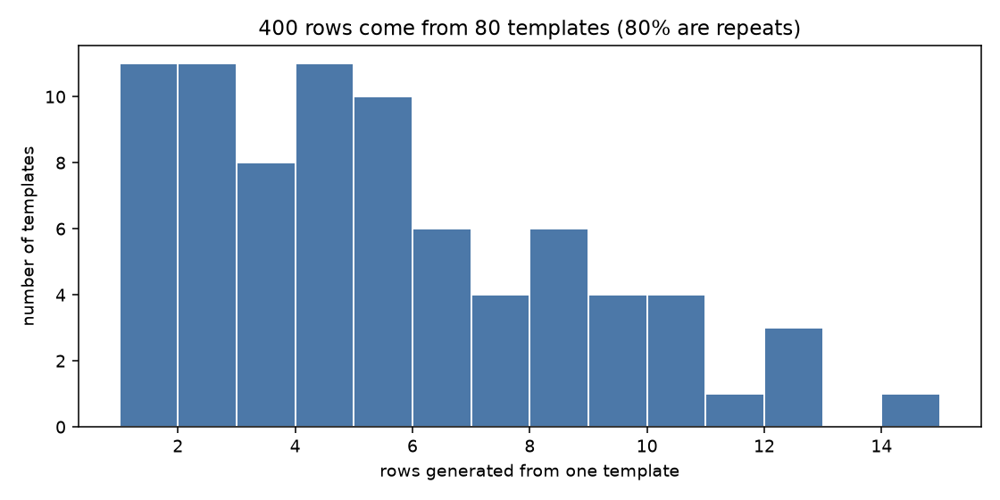
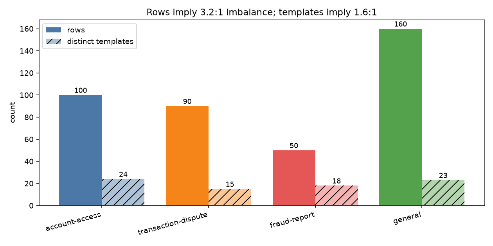
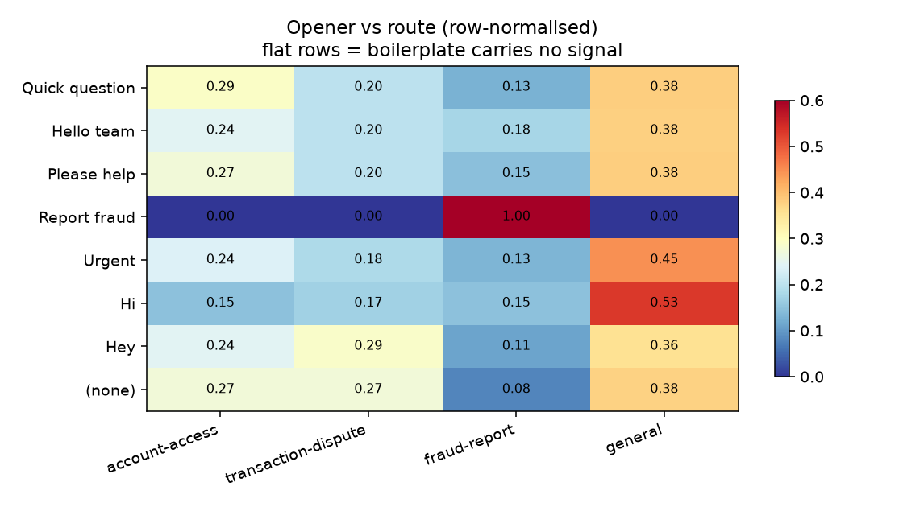
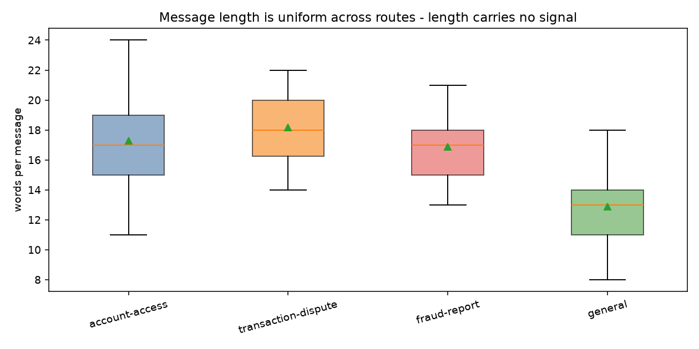
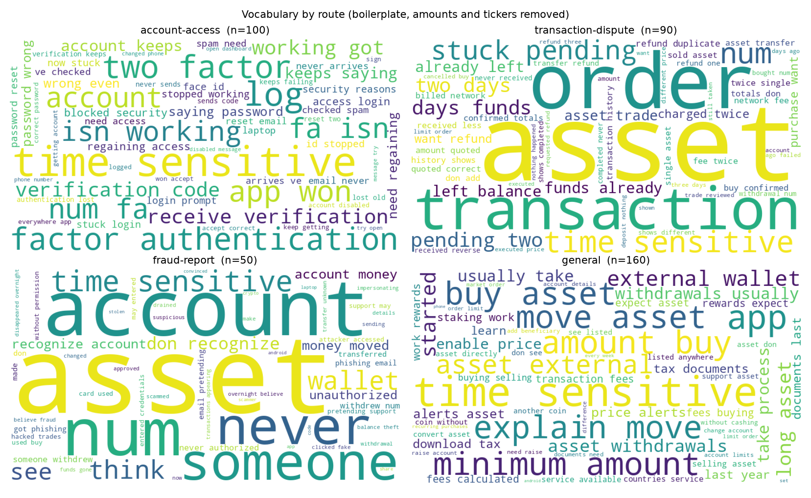
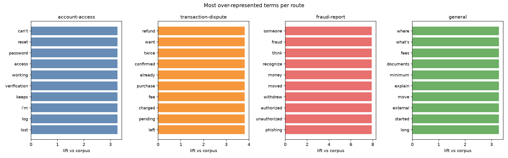

# Exploratory data analysis

## Shape

- **400** labelled messages, 2 columns (`text`, `label`)
- **0** exact duplicate texts
- Vocabulary: **303** distinct content words
- Length: 8-24 words (median 16), 42-128 characters

## The dataset is template-generated

400 rows -> 172 normalised forms -> 80 groups after similarity merge (largest group 14 rows, 80.0% of rows are template repeats)

Normalising away the randomised opener, closer, amount and ticker collapses 400 rows to **172** distinct forms, and near-duplicate clustering reduces that further to **80** template groups. The largest single template accounts for 14 rows.

**This is the single most important fact about the data.** The effective sample size is ~80, not 400. Any evaluation that splits rows at random will place near-identical messages on both sides of the split and report a score the hidden holdout will not reproduce.

## Class balance is not what the row counts suggest

| route | rows | templates | rows/template |
|---|---:|---:|---:|
| account-access | 100 | 24 | 4.2 |
| transaction-dispute | 90 | 15 | 6.0 |
| fraud-report | 50 | 18 | 2.8 |
| general | 160 | 23 | 7.0 |

At the row level the imbalance is **3.2:1**. At the template level it is **1.6:1**. The gap is duplication: `general` has the most rows but not proportionally more distinct messages, while `fraud-report` has the fewest rows and a comparable number of templates.

This is why the imbalance strategy here is class weighting rather than oversampling. SMOTE or naive duplication would interpolate between renderings of the *same* template and add no information at all, while making the leakage problem worse.

## Boilerplate is noise, not signal

| opener | account-access | transaction-dispute | fraud-report | general |
|---|---:|---:|---:|---:|
| Quick question | 16 | 11 | 7 | 21 |
| Hello team | 11 | 9 | 8 | 17 |
| Please help | 15 | 11 | 8 | 21 |
| Report fraud | 0 | 0 | 1 | 0 |
| Urgent | 9 | 7 | 5 | 17 |
| Hi | 7 | 8 | 7 | 25 |
| Hey | 11 | 13 | 5 | 16 |
| (none) | 31 | 31 | 9 | 43 |

Openers are spread across routes in roughly the corpus proportions. Notably **`Urgent` does not indicate fraud** - it appears on more `general` messages than `fraud-report` ones. A model that keys on it is fitting noise, which is a live risk given char n-grams will happily learn these tokens.

They are stripped for *grouping* but deliberately left in the text the models see, because the hidden holdout will carry the same boilerplate.

## Length carries no signal

| route | mean words | median | min | max |
|---|---:|---:|---:|---:|
| account-access | 17.3 | 17 | 11 | 24 |
| transaction-dispute | 18.2 | 18 | 14 | 22 |
| fraud-report | 16.9 | 17 | 13 | 21 |
| general | 12.9 | 13 | 8 | 18 |

## Vocabulary by route

### Most over-represented terms

- **account-access**: `can't` (3.27x), `reset` (3.27x), `password` (3.27x), `access` (3.27x), `working` (3.27x), `verification` (3.27x), `keeps` (3.27x), `i'm` (3.27x)
- **transaction-dispute**: `refund` (3.81x), `want` (3.81x), `twice` (3.81x), `confirmed` (3.81x), `already` (3.81x), `purchase` (3.81x), `fee` (3.81x), `charged` (3.81x)
- **fraud-report**: `someone` (7.91x), `fraud` (7.91x), `think` (7.91x), `recognize` (7.91x), `money` (7.91x), `moved` (7.91x), `withdrew` (7.91x), `authorized` (7.91x)
- **general**: `where` (3.28x), `what's` (3.28x), `fees` (3.28x), `documents` (3.28x), `minimum` (3.28x), `explain` (3.28x), `move` (3.28x), `external` (3.28x)

The `fraud-report` / `transaction-dispute` boundary is the one that matters: both are about missing money, and they separate on *agency* (`authorized`, `phishing`, `someone` vs `cancelled`, `order`, `pending`) rather than on topic. That is a semantic distinction, which is the substantive argument for why sentence embeddings outperform bag-of-n-grams here.

## What this implies for modelling

1. **Split on templates, not rows.** Otherwise ~95% of every test fold is already memorised. See `reports/comparison.md`.
2. **Use macro-F1, not accuracy.** `general` is 40% of rows; predicting it always scores 0.40 accuracy and 0.0 recall on the route that matters.
3. **Weight classes, do not resample.** The real imbalance is mild once duplication is accounted for.
4. **Prefer semantic features.** The hard boundary is about who acted, not about which words appear.

---

Figures: `class_distribution.png`, `length_distribution.png`, `boilerplate_vs_label.png`, `template_group_sizes.png`, `wordclouds.png`, `distinctive_terms.png`
